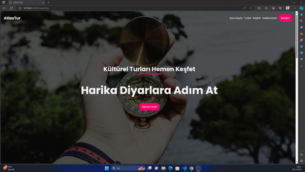

# SCSS Tur  Çalışması

SCSS kullanılarak  hazırlanmış  Tur projesi web sayfası çalışmasıdır.

## Özellikler

- SCSS kullanıldı
- Animasyonlu Buttonlar Eklendi
- Canlı ön izleme
- Tam ekran modu

  
## Geri Bildirim

Herhangi bir geri bildiriminiz varsa, lütfen avcisalihoffical@gmail.com adresinden bize ulaşın.

  
## Kullanılan Teknolojiler

**İstemci:** HTML  , Css, SCSS

**Editör:** Visual Studio Code

